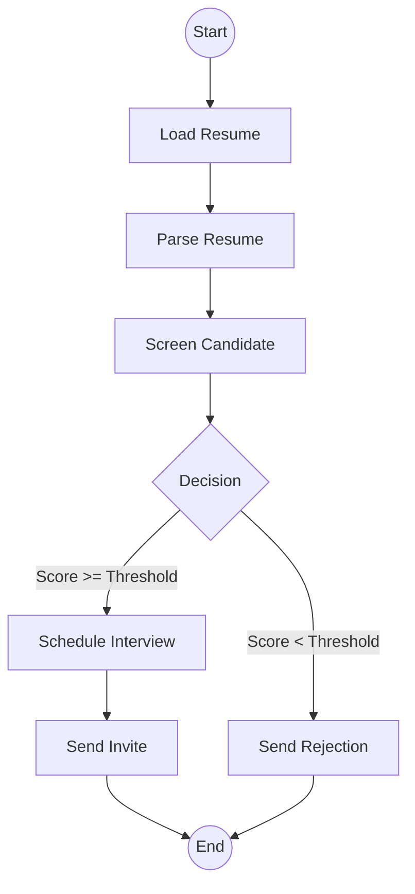

# Employee Recruiter Agent 🤖

[](https://www.python.org/)
[](https://fastapi.tiangolo.com/)
[](https://github.com/langchain-ai/langgraph)
[](https://opensource.org/licenses/MIT)


An enterprise-grade, AI-powered recruitment pipeline that automates the entire candidate lifecycle: from resume ingestion and parsing to intelligent screening and automated interview scheduling.

---

## 🚀 Overview

The **Employee Recruiter Agent** is a sophisticated autonomous system built on **LangGraph**. It orchestrates a multi-step workflow designed to reduce the overhead of technical recruiting. By leveraging LLMs (Groq/Gemini) and asynchronous task processing, it ensures high throughput and stateful execution.

### Key Capabilities
- 📄 **Intelligent Parsing**: Automatically extracts structured JSON data from PDF resumes using specialized LLM prompts.
- 🎯 **Advanced Screening**: Scores candidates against job descriptions with objective justification.
- 🧠 **Autonomous Decisioning**: Uses configurable thresholds to decide between scheduling interviews or sending rejections.
- ⏱️ **Asynchronous Processing**: Handles heavy LLM tasks in the background using **Redis** and **RQ**.
- 💾 **State Persistence**: Maintains workflow state across restarts using **MongoDB**.

---

## 🏗️ Architecture

The system follows a directed acyclic graph (DAG) structure managed by LangGraph:



### Components
- **API Layer**: FastAPI handles incoming requests and provides job status monitoring.
- **Worker Layer**: RQ (Redis Queue) processes the LangGraph workflows asynchronously.
- **Persistence Layer**: MongoDB stores the state of each recruitment "thread".

---

## 🛠️ Tech Stack

- **Core Framework**: LangGraph, LangChain Community
- **API Framework**: FastAPI, Uvicorn
- **Task Queue**: Redis, RQ (Python-RQ)
- **Database**: MongoDB (State Checkpointing)
- **LLM Providers**: Groq (Default), Google Gemini (Optional)
- **Document Processing**: PDFMiner

---

## ⚙️ Getting Started

### Prerequisites

Ensure you have the following installed and running:
- **Python 3.10+**
- **Redis Server** (`brew install redis` or `docker run -p 6379:6379 redis`)
- **MongoDB** (Local or Atlas)

### Installation

1. **Clone the repository:**
   ```bash
   git clone https://github.com/yourusername/EmployeeRecuiterAgent.git
   cd EmployeeRecuiterAgent
   ```

2. **Initialize Environment:**
   Using `uv` (recommended) or `pip`:
   ```bash
   python3 -m venv .venv
   source .venv/bin/activate
   pip install -r requirements.txt
   ```

3. **Configure Environment Variables:**
   Create a `.env` file from the example:
   ```bash
   cp .env.example .env
   ```
   Required variables:
   ```env
   GROQ_API_KEY=your_groq_api_key
   MONGODB_URI=mongodb://localhost:27017/recruiter_agent
   REDIS_URL=redis://localhost:6379
   ```

### Running the System

The easiest way to start both the API server and the background worker is using the provided script:

```bash
chmod +x start.sh
./start.sh
```

Alternatively, run them separately:
```bash
# Terminal 1: RQ Worker
rq worker -u $REDIS_URL --worker-class rq.SimpleWorker

# Terminal 2: FastAPI Server
python main.py
```

---

## 📋 API Documentation

### 1. Synchronous Execution
Execute the workflow and wait for the final result.

**Endpoint:** `POST /execute_workflow`

**Payload:**
```json
{
  "candidate_info": {
    "name": "Jane Doe",
    "email": "jane@example.com",
    "phone": "+123456789",
    "resume_url": "https://example.com/resume.pdf"
  },
  "thread_id": "unique-session-id-001",
  "job_spec": {
    "title": "Senior Software Engineer",
    "description": "Expert in Python, FastAPI, and AI agents.",
    "required_skills": ["Python", "LangChain"]
  }
}
```

### 2. Asynchronous Execution (Recommended)
Enqueue the workflow and get a `job_id`.

**Endpoint:** `POST /rq/workflow`

**Response:**
```json
{
  "status": "ok",
  "job_id": "550e8400-e29b-41d4-a716-446655440000"
}
```

### 3. Check Job Status
Monitor the progress of a background job.

**Endpoint:** `GET /rq?job_id=<job_id>`

---

## 🛠️ Development

### Customizing Workflow
The graph logic is defined in `queues/graph.py`. You can adjust the `threshold` in the `decide` node or add new nodes for additional steps (e.g., background checks, coding tests).

### Testing
Run the test suite:
```bash
pytest tests/
```

---

## 📄 License

This project is licensed under the MIT License - see the [LICENSE](LICENSE) file for details.

---

**Built with ❤️ for the recruitment community.**
