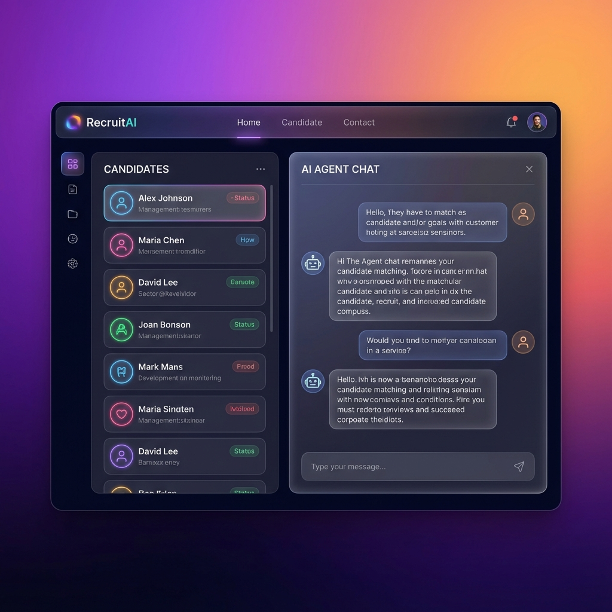
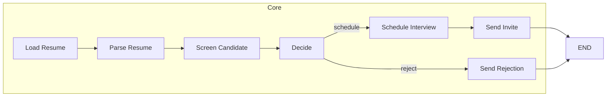

# Employee Recruiter Agent 🤖



*An AI‑powered recruiting assistant that automates candidate sourcing, resume parsing, and interview scheduling.*

---

## Table of Contents
- [Overview](#overview)
- [Features](#features)
- [Architecture](#architecture)
- [Dependencies](#dependencies)
- [Installation](#installation)
- [Configuration](#configuration)
- [Usage](#usage)
- [Development](#development)
- [Contributing](#contributing)
- [License](#license)

---

## Overview
The **Employee Recruiter Agent** is a Python‑based AI agent built with **LangGraph**. It demonstrates a complete end‑to‑end recruiting pipeline that:
- Loads a resume PDF from a URL.
- Parses the resume into a structured JSON schema using **PDFMiner** and LLM prompting.
- Scores the candidate against a job description via an LLM (Groq or Google Gemini).
- Decides whether to schedule an interview or reject the candidate.
- (Optionally) creates a mock Zoom meeting payload and logs an email notification.

The project showcases how to combine document loading, LLM prompting, and graph‑based state management in a reproducible workflow.

---

## Features
- **Resume loading** from a remote PDF URL.
- **Structured resume parsing** into a detailed JSON schema.
- **Candidate evaluation** with a numeric score and concise justification.
- **Decision logic** (schedule vs. reject) based on a configurable threshold.
- **Mock interview scheduling** (Zoom‑style payload).
- **Email notification** stub (prints to console).
- **Graph‑based workflow** using LangGraph’s `StateGraph`.
- **Extensible** – replace mock functions with real services (e.g., real Zoom/SMTP).

---

## Architecture

The diagram visualises the sequential flow of states managed by the LangGraph `StateGraph`.

---

## Dependencies
- **Python >=3.10**
- `langgraph`
- `langchain‑community` (PDFMiner loader)
- `langchain‑google‑genai` (optional Gemini support)
- `langchain‑groq` (optional Groq support)
- `python‑dotenv`
- `requests` (for downloading PDF URLs)
- `pytest` (for testing)

Install all required packages via the `requirements.txt` file.

---

## Installation
```bash
# Clone the repository
git clone https://github.com/yourusername/EmployeeRecuiterAgent.git
cd EmployeeRecuiterAgent

# Create a virtual environment
python3 -m venv .venv
source .venv/bin/activate

# Install Python dependencies
pip install -r requirements.txt

# Copy example environment file
cp .env.example .env
```

---

## Configuration
Create a `.env` file (or edit the copied one) with the keys required for LLM access:
```
# LLM providers (choose one)
GEMINI_API_KEY=your_gemini_key   # for Google Gemini
GROQ_API_KEY=your_claude_key   # for Anthropic/Claude via Groq
```
Only one of the above keys is needed for the core demo. Additional keys (e.g., calendar or database) are optional and can be added later if you extend the project.

---

## Usage
Run the main script which builds and executes the LangGraph workflow:
```bash
python main.py
```
The script will:
1. Load the sample resume URL defined in `main.py`.
2. Parse it, evaluate it against the sample job description, and decide.
3. Print the final state, including any mock meeting info or email status.

Feel free to edit `main.py` to supply your own `resume_url` and `job_desc` values.

---

## Development
### Testing
```bash
pytest -vv
```
### Linting & Formatting
```bash
black .
ruff check .
```
### Adding New Nodes
1. Implement a new function that accepts and returns `EmployeeRecruiterState`.
2. Register it with `recruit_graph.add_node("name", function)`.
3. Connect it using `add_edge` or `add_conditional_edges`.

---

## Contributing
Contributions are welcome! Please:
1. Fork the repository.
2. Create a feature branch (`git checkout -b feat/awesome-feature`).
3. Write tests for your changes.
4. Open a Pull Request with a clear description.

---

## License
This project is licensed under the **MIT License** – see the `LICENSE` file for details.

---
